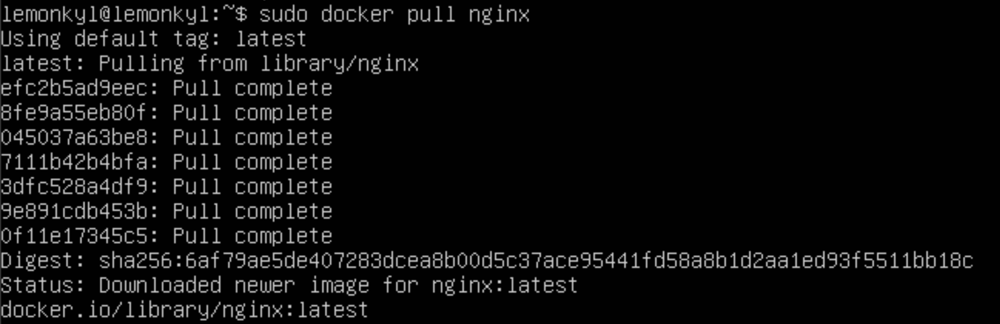

## Part 1. Готовый докер
+ Возьми официальный докер-образ с nginx и выкачай его при помощи docker pull.
Для начала устанавливаем докер на убунту, для этого используем команду `sudo apt istall docker.io`. Затем вводим команду `sudo docker pull nginx` для установки докер-образа с nginx:

+ Проверь наличие докер-образа через docker images.

+ Запусти докер-образ через docker run -d [image_id|repository].

+ Проверь, что образ запустился через docker ps.

+ Посмотри информацию о контейнере через docker inspect [container_id|container_name].
Используем команду `sudo docker inspect gifted_swartz`:

+ По выводу команды определи и помести в отчёт размер контейнера, список замапленных портов и ip контейнера. Используем команду `sudo docker inspect gifted_swartz --size | grep -i -e Size` для того, чтобы узнать размер и команду `sudo docker inspect gifted_swartz | grep IPAddress`:

Чтобы узнать список замапленных портов, читаем файл gifted_swartz:

+ Останови докер контейнер через docker stop [container_id|container_name].

+ Проверь, что контейнер остановился через docker ps.

+ Запусти докер с портами 80 и 443 в контейнере, замапленными на такие же порты на локальной машине, через команду run.

+ Проверь, что в браузере по адресу localhost:80 доступна стартовая страница nginx.  

Для начала закрываем виртуальную машину и в настройках в параметре "сеть" делаем проброс портов для nginx:

Только после этого заходим на сайт `localhost:80`:

+ Перезапусти докер контейнер через docker restart [container_id|container_name].

+ Проверь любым способом, что контейнер запустился.

## Part 2. Операции с контейнером
+ Прочитай конфигурационный файл nginx.conf внутри докер контейнера через команду exec.  
Вводим в терминале `sudo docker exec + имя контейнера и команду cat`:

+ Создай на локальной машине файл nginx.conf.  
Создаем в src файл nginx.conf и копируем содержимое файла nginx.conf. 
+ Настрой в нем по пути /status отдачу страницы статуса сервера nginx.  
Дописываем внизу необходимые строчки:

+ Скопируй созданный файл nginx.conf внутрь докер-образа через команду docker cp.

+ Перезапусти nginx внутри докер-образа через команду exec.

+ Проверь, что по адресу localhost:80/status отдается страничка со статусом сервера nginx.  
При открытии cайта:

+ Экспортируй контейнер в файл container.tar через команду export.
+ Останови контейнер.

+ Удали образ через docker rmi [image_id|repository], не удаляя перед этим контейнеры.

+ Удали остановленный контейнер.

+ Импортируй контейнер обратно через команду import.

+ Запусти импортированный контейнер.

+ Проверь, что по адресу localhost:80/status отдается страничка со статусом сервера nginx.

## Part 3. Мини веб-сервер
+ Напиши мини-сервер на C и FastCgi, который будет возвращать простейшую страничку с надписью Hello World!.  

Для начала устанавливаем необходимую библиотеку fcgi и компилятор через команды `sudo apt-get update` и `sudo apt-get install -y gcc spawn-fcgi libfcgi-dev`. 

Затем создаём в папке src папку server и в ней файл `web-server.c`, после чего пишем наш мини-сервер:

+ Запусти написанный мини-сервер через spawn-fcgi на порту 8080.  
Используем команду `gcc -o server web-server.c -lfcgi`, затем используем `spawn-fcgi -p 8080 ./web_server`:

+ Напиши свой nginx.conf, который будет проксировать все запросы с 81 порта на 127.0.0.1:8080.
Открываем файл nginx.conf и прописываем:

+ Проверь, что в браузере по localhost:81 отдается написанная тобой страничка.

+ Положи файл nginx.conf по пути ./nginx/nginx.conf (это понадобится позже).

Для перезагрузки используем команду `sudo docker exec -i nostalgic_wiles nginx -s reload`.

Сделала это выше.

## Part 4. Свой докер

+ Напиши свой докер-образ, который:
1) собирает исходники мини сервера на FastCgi из Части 3;
2) запускает его на 8080 порту;
3) копирует внутрь образа написанный ./nginx/nginx.conf;
4) запускает nginx.

Cоздаём файлы в папке src - Dockerfile и obraz.sh:

+ Собери написанный докер-образ через docker build при этом указав имя и тег.

+ Проверь через docker images, что все собралось корректно.

+ Запусти собранный докер-образ с маппингом 81 порта на 80 на локальной машине и маппингом папки ./nginx внутрь контейнера по адресу, где лежат конфигурационные файлы nginx'а (см. Часть 2).  
Используем команду: `sudo docker run -it --name obraz -p 80:81 -v /Users/lemonkyl/DO5_SimpleDocker-1/src/nginx.conf:/etc/nginx/nginx.conf -d lemonkyl:1.0 bash`
+ Проверь, что по localhost:80 доступна страничка написанного мини сервера.

+ Допиши в ./nginx/nginx.conf проксирование странички /status, по которой надо отдавать статус сервера nginx.

+ Перезапусти докер-образ.

+ Проверь, что теперь по localhost:80/status отдается страничка со статусом nginx

## Part 5. Dockle
 + Просканируй образ из предыдущего задания через dockle [image_id|repository].

 Устанавливаем dockle, скачиваем через github: 
 
 Затем сканируем докер-образ через команду `dockle lemonkyl1.0`:
 
+ Исправь образ так, чтобы при проверке через dockle не было ошибок и предупреждений.

Исправили образ:

Ответ скана:

## Part 6. Базовый Docker Compose

+ Напиши файл docker-compose.yml, с помощью которого:
1) Подними докер-контейнер из Части 5 (он должен работать в локальной сети, т.е. не нужно использовать инструкцию EXPOSE и мапить порты на локальную машину).
2) Подними докер-контейнер с nginx, который будет проксировать все запросы с 8080 порта на 81 порт первого контейнера.

+ Замапь 8080 порт второго контейнера на 80 порт локальной машины.

+ Останови все запущенные контейнеры.
+ Собери и запусти проект с помощью команд docker-compose build и docker-compose up.

+ Проверь, что в браузере по localhost:80 отдается написанная тобой страничка, как и ранее.

## СПАСИБО ЗА ВНИМАНИЕ!

